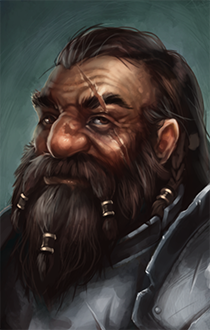

# Benðron Vörðurhínn

Benðron Vörðurhínn is a young dwarf, 66 years old. He stands 4 foot 2 inches tall and weights 190 pounds. He is a fighter with intensive training in polearms, and the only known survivor of an ancient clan of dwarves - the Yundri.

The Yundri had a long history. They dominated the mountains of the western coast, and were noted for their fine craftsmanship and martial prowess - warriors who would dance their pole-arms through the battlefield like a deft painter traced his brush across a canvas, leaving a deadly work of art in their wake. Not a town could be found without Yundri goods or guards, their name a widely recognized stamp of quality. But even they could not weather the Storms.

The first occurrence was thought to be a fluke: repairs on the trading cities was begun immediately but the Storms returned before they could be completed. Seeing the futility, the Yundri retreated into their ancient mountain cities, leaving the grand plain and river cities to crumble under the constant barrage of rain and wind. But the clan had survived. They lived inside the mountains, and they waited for calm, a calm that would never come.

Over time, the Storms only got worse. Even the mountains grew tired and laid flat. When the first mountain fell, trapping the city of Beghdarohm, the first cities of Gildum and Gornulir organized a joint rescue team. It returned with warnings. Work started to reinforce the mountains - the best Earthshapers were sent to the most vulnerable cities. But they were only buried first. One by one, the mountains fell. And one by one, the cities were buried. Some 1500 years after the Storms had started, the Yundri had been reduced to a memory of the former tribe - a few thousand dwarves sheltered in the deepest refuge, beset by the Storms above and invaders below.

Into this last refuge was born the son of Bendren. Like all the others born in the depths, he was taught the clan's history and pride, and was guided to find his place in it. He showed little interest or aptitude in the ancient magics of Earthshaping, and didn't do much better with spellwork, aside from some basic weapon cleaning and sharpening cantrips. The son of Bendren's true skill was in the traditional Art of the pole-arm, a tool he quickly mastered, propelling him into a place in the defense of the clan from the invading goblins from below.

1530 years after the Storms began, the son of Bendren was given the name Bendron in the clan's decennial Naming - the Yundri are named in their 30s and wed in their 70s - he was one of only 23 who had survived to the naming that decade - most of his peers had not survived the rough youth found in the depths. As a new adult in the clan, Bendron chose to join the Guard, or Vörður, keeping the clan pure from outside attacks and internal decay. Bendron rose quickly in this role. He was dogmatic in his beliefs and a prodigy in the Art, and quickly became a mentor to the other Guards. He was given the title Vörðurhínn, meaning Foremost Among the Guards. With the next Naming, ten of the 18 Named wanted to follow Bendron as Guards, a testament to his rising status in the clan. He mentored them as he was able, but two ventured too far into the caves and never returned. In a closed society which only welcomes around twenty adults each decade, the loss of two individuals weighed heavy on Bendron, motivating him to focus deeper on the clan's philosophy and find solace in it. By his 15th named year, Bendron had become the dominant voice in the Guard: elder members deferred to his judgment due to his previous success, but Bendron never fully realized this influence. He was content to find meaning in his individual contributions.

In his 21st named year, the clan's elders had seen the declining rates of Naming and sought a solution. In the hope that the Storms had ended at some point, they organized an expeditionary force to find a way to the surface, then return with food, hope, and a way forward for the clan. Bendron volunteered himself for the party, but the elders recommended that he remain. They had seen that his influence, even if it was not being exercised, was growing quickly, and that he would soon be a near-universally respected voice in the clan - not something that could be lost. Of course, Bendron acquiesced to the suggestions of the elders. They had done great things in the past and always displayed solid judgement. He did not need to understand the reasoning to understand the benefit for the clan.

Roughly fifteen years later, the elders' worst fears had been realized. The expedition had failed to return, the Naming had no new adults to welcome, and there were only a handful of dwarves who had hit the bar of forty named years for the Pairing. The clan was decaying, and the refuge offered no way forward, and no way out. The elders last plan was put into action. They selected some number of the healthiest clan members to be put into a deep stasis, in the hope of re-awakening after the Storms had passed and carrying on the clan. None were told how many were chosen, or who the others might be. Bendron had been kept from the expedition for this purpose - as a best last hope for continuation. He had spent the last decade out of the Guard, focusing instead on the collection and transfer of the clan's collective knowledge and relishing in the practical application of the Art against the frequent invaders. He had mastered the clan's knowledge and traditional weaponry, and was so respected that he was referred to as an elder while not present, in spite of his youth. In his thirty-sixth named year, Bendron was given one of the clan's few remaining relics, an ancient signet ring, and was put to sleep with his halberd by the last of the clans great wizards, in the hope to awaken in a better age and revive the Yundri.

Bendron awoke an age later when Chadwick and Gideon happened to camp upon his place of rest. He adventured with them for a time, searching for any trace of his clan, but slowly lost hope. Instead, he focused his efforts into keeping his friends safe and the proper Yundri ways observed. If Bendron was the last of the Yundri, then his clan, or party, or crew was as well.