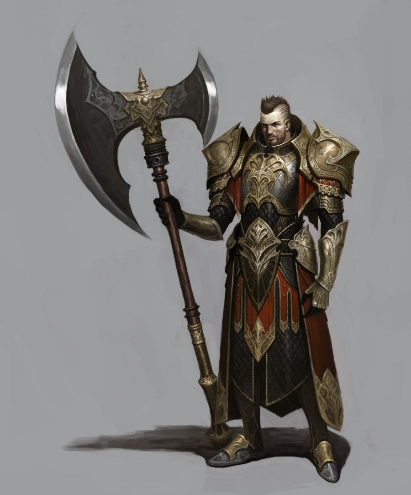

#  Chadwick Bronzecut

Chadwick Bronzecut was born in the middle-sized town of Hemberg, which mainly served as a support town for the nearby, larger army garrison town called Enfis. His parents, Dorian and Amelia Bronzecut, were tradesmen, and modestly successful ones. His family growing up was by no means destitute, but due to lack of ambition always remained fairly lower class. This always struck young Chadwick as weakness and, growing up, he decided he would do whatever he could to get ahead.

He found religion in his early teens when lost on a hunting excursion. Already a strong young lad, Chadwick assisted an old man who was stuck under a tree that had fallen as a result of being weakened by a recent storm. When the man revealed himself as Arlos Dalben, an old priest of Hyroneus (a god worshiped locally in the area, as well as the larger kingdom of which his town was subservient), he offered to take Chadwick on as an apprentice. The idea that a power existed that, by following, man could lift himself out of his earthly squalor and extend his influence immediately appealed to the boy, and he dropped everything to accept. In exchange for the hard labor that comes easy to youth, Arlos taught Chad the Old Ways of worship deemed archaic by the general public. The two grew very close, and Arlos became Chadwick's most trusted mentor. Chadwick became a Righteousness Paladin of Hyroneus on the third day of Baelin, on the Feast of Hyroneus, in the year 3003 AU, at the age of 18. He swore the following Oath to the Crown of Hyroneus:

"The Law of Hyroneus must be upheld with impunity and his Goodness must be permeated to every corner of the world.

Where chaos threatens stability, I shall be the bulwark against the storm.
Where evil threatens innocence, I shall be the shield against the onslaught.
Amidst the forces of anarchy I shall stand firm, and in the face of tyranny I will cry out for justice.

When assaulted with temptation, to Hyroneus and none other shall I remain true.
And when enticed by pride, wrath, lust, envy, gluttony, lethargy, greed, or any form that disarray and evil may take, I shall not be seduced.

And so upon my honor and before my god, I do hereby solemnly pledge my shield, my body, my mind, my soul, and my very life to the divine Crown of Hyroneus the Protector, lord of all that is pure, holy, and true, and to his most powerful will and mission, that I may never falter in my quest to bring him honor and to vanquish his enemies. Should ever I betray that most holy Crown, let Hyroneus himself see fit to end my life and thereby bring purity and order to this world by removing me from it.

Thus I pray and thus let it be heard by all who witness, in the mighty name of Hyroneus, Amen."

---

Later that same year, when Chadwick was still 18, his older brother Lancewick was caught and martyred, while on a mission trip down south to the Audari grasslands, by invading  orcs. This event caused Chad to enlist in the kingdom's army to join in on their crusades against these people. In the army, Chad met Devin Euffire, a fellow paladin. Devin was a Freedom Paladin of Aurín, and the two got along swimmingly. Their personalities jived perfectly, and they quickly became drinking buddies and close friends on the battlefield.

Due to his strength and his magic, Chad made quite a name for himself, and a decent amount of money too. When he was 22, as a junior officer, he was given the opportunity to lead a small regiment on crusade. He spent three years in that area, supporting the operations. During that time, he had several run-ins with a particular orc captain who gave him a significant amount of grief on the battlefield. The orc captain, named Tandaga, was one of the smarter orc officers. Several times, he outwitted Chadwick, sometimes pressing successful offensives against the crusader forces, sometimes stymieing offensive efforts by the crusaders. Tandaga was one of the only orc officers who continually challenged Chadwick's wit, strategic thinking, and leadership ability; the smug orc succeeded in frustrating the paladin constantly, much to the orc captain's pleasure. One night, in a sneak attack during a temporary ceasefire, Tandaga and his raiding party killed over twenty of Chad's men in their sleep, slitting their throats without honor. The next morning, Tandaga taunted Chadwick from a nearby hilltop, rubbing the tragedy in the paladin's face. Many of the men who died that night were close personal friends and brothers-in-arms of Chadwick. At that moment, he swore to kill Tandaga to exact justice for his fallen men.

Early on in his campaign, his troops stumbled across a tribe of barbarians, who were under siege by a troop of orcs. Outnumbered and caught on foot, the barbarians did not have the advantage of their fearsome warhorses. They were being overrun. It looked like the end for them, but just as the situation began to look unwinnable, Chadwick and his knights flanked the orcs from out of the blue and made quick work of them. Together, the barbarians and the Crusaders dispatched the orc raiding party with ease. Though unlikely allies, the barbarians and the knights made peace through the destruction of their mutual enemy, and Chadwick and Devin formed an official armistice with Gideon and Rogo, the leaders of the barbarian tribe called the Ul Vadr. Beyond that, a close friendship based in blood and revelry developed between Chadwick and Gideon, who was the son of the Ul Vadr tribal chief. A devout religious man, Chadwick oftentimes attempted to convert his swarthy friend, but as the years went by he settled for preaching by example. It didn’t help that more than a few times Chadwick called upon Gideon and his band of warriors to take care of some more unsavory missions, unsuitable for Holy War.

---

For the next year, the Crusaders worked with the Ul Vadr to demolish the orc forces. Things were looking good, and the orcs were being pushed back, so Chad returned to his home a hero of sorts, and as a result was afforded a comfortable life. As soon as he got home, he proposed to his longtime sweetheart, Mirian. They had been in love since before he left for the crusade but he had never had the means to wed. Now, that was not the case. Mirian shared his religious devotion and was head over heels in love with him, as he was with her; they were a perfectly matched couple. The two were happily engaged and began to plan their wedding immediately.

Chadwick worked in defense strategy to repel the continuing orc invasion, and never stopped training, but always felt that the battlefield was calling him back. However, there were cowards who were jealous of his status, and plotted to remove him from the picture. Foremost among these was Artimeus Rathenhurst, the son of a noble, but not nearly as charismatic, handsome, skilled in combat, or fortunate as Chadwick. Chad being a man of virtue and discipline, the worst that Artimeus and the naysayers could bring against him was his oftentimes too-keen fondness for whiskey. But they saw an opening when his immediate superior’s wife expressed a passing interest in him. They began to spread rumors that Chadwick and the commander’s wife were having an affair.

The final straw came when the commander was away on a trip. After a night of drinking, carousing, and recounting war stories with those with whom he had served, Chadwick awoke to find his left gauntlet missing, and his door unlocked. Chad's enemies brought the rumors to commander’s attention, and being a jealous man, he confronted both of them. They both denied the accusations, and Chadwick’s reputation should have been enough to carry him, but alas! That gauntlet was found in the marital room, near damning evidence in a jealous mind. A court martial was brought against the young paladin, and Artimeus, along with Chad's other detractors, was quick to bring up his lowly background, to defame him as much as they could.

With such ammunition against him, the case was a short one, and Chadwick was dishonorably discharged from the military. Due to the fact that his “crime” was one of immorality, the local religious officials shunned him as well. A few dear friends and his beloved trusted him still, including Arlos and Devin, and of course Mirian, but what pull Chad had at any time was not enough to keep him afloat. All but ruined, he decided that the only thing remaining for him was Mirian, and in his current state there was no way he would be able to make a life for her. He chose instead that he must leave and build a new reputation.