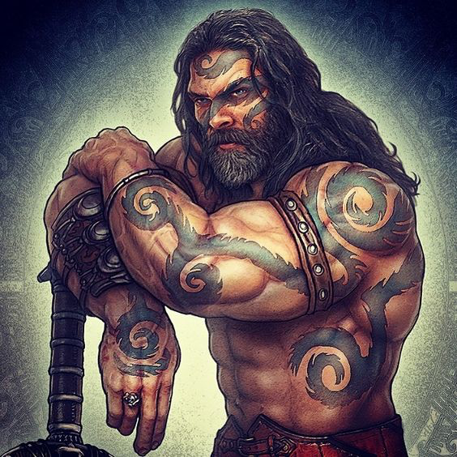

#  Gideon ben Jacen

Gideon was born to the chieftain of the Ul Vadr, a nomadic tribe of mounted warriors. Their domain was the entire southern peninsula, from Thordos to Lerren, an area of over ten thousand square miles. Skilled in mounted combat and taught from a young age how to ride, these tribesmen made a formidable opponent to any and all that opposed them. Rarely staying in one place for long, they were always on the move, in search of battle and plunder. 

Gideon, like every other boy in the tribe, was trained from the time he could stand in both mounted and foot combat. The regimen included everything from archery to sword skills to fighting with spears, but Gideon excelled at the use of the two handed sword. Being one of the bigger and stronger men of the tribe, he was able to wield the great weapon with relative ease, even on horseback. By the time he was 18 he was widely regarded as a champion of the Ul Vadr clan and one of their most talented warriors, fighting in multiple battles over the course of his young life. From a young age, Gideon was very close friends with Rogo, another boy in the tribe. Rogo was also an extremely skilled warrior, specializing in the scythe and dagger combination. During their years of raids and battle together, they saved each other's lives and became brothers: a bond far stronger than mere friendship, forged in the blood and iron of battle.

Gideon accompanied his father on many campaigns against other tribes in the region. Rogo almost always accompanied them, and the two young men only grew closer with time. Gideon excelled on the field of battle, vanquishing many enemies in the name of the Ul Vadr. His weapon of choice was a massive greatsword, though he was also deadly while dual wielding his short sword and dagger when on foot. The feats of Gideon, son of Jacen fast became legend. Tales of his barbaric rage struck fear into the hearts of all tribes in the region. With Gideon leading his father's warriors into battle Ul Vadr soon became the strongest tribe in the southern peninsula. With their power consolidated, the tribe was able to finally settle down and found a city-state -- Keveyr -- at the southeast edge of the peninsula. From there they were able to govern the lands they had fought to conquer. 

---
When word reached the Ul Vadr that an army of  orcs had gathered in the east and was bent on moving toward their territory, Gideon (21) led a modest force of three score strong riders, including Rogo as his lieutenant and right hand man, toward the threat. They rode almost 500 miles and within a few weeks had reached the orc threat. For almost a year, Gideon and his Ul Vadr wreaked havoc on the orc forces, introducing the orc brutes to a style of mounted combat they had never seen before. Soon though, Gideon's numbers were diminished, and his former force of three score now numbered barely three dozen. Weakened but not discouraged, the Ul Vadr refused to return home. They continued to wage war on the orc until one fateful day, they were caught off guard by a surprise raid.

Outnumbered and caught on foot, the Ul Vadr did not have the advantage of their fearsome warhorses. They were being overrun. It looked like the end for Gideon and Rogo, and their fighting force of brave Ul Vadr, but just as the situation began to look unwinnable, a troop of northern knights flanked the orcs from out of the blue and made quick work of them. Together, the Ul Vadr and the Crusaders dispatched the orc raiding party with ease. Though unlikely allies, the barbarians and the knights made peace through the destruction of their mutual enemy, and Gideon and Rogo formed an official armistice with Chadwick and Devin, the leaders of the band Crusaders. Beyond that, a close friendship based in blood and revelry developed between Gideon and Chadwick, who was a Holy Paladin of Hyroneus. A devout religious man, Chadwick oftentimes attempted to convert Gideon, though unsuccessfully. For the next three years, the Ul Vadr worked with the Crusaders to demolish the orc forces. Things were looking good, and the orcs were being pushed back, so Gideon and Rogo left with their remaining Ul Vadr to return home, leaving the war in the hands of the more than capable Crusader knights.

After this three year campaign against the orcs, Gideon (25) returned victorious to Keveyr, only to find that his family had been banished from the tribe. A warrior called Sahib had undermined his father's power within the clan and forced him out by way of one on one combat for control of the tribe. Immediately upon hearing this Gideon asked about the whereabouts of his family. The only information that he could find was that they headed north. In an attempt to reclaim the tribe that was his to rule by right, he challenged Sahib to a duel. The battle was long and grueling. Gideon's unstoppable power against Sahib's blinding speed. Eventually after almost thirty minutes of combat, Sahib's speed and experience won out and Gideon was exiled from the Ul Vadr tribe and all the lands they controlled. Rogo and the two dozen men who had returned with Gideon from the east were still loyal to Gideon and Jacen, but kept quiet so as not to be banished. Rogo bid farewell to Gideon, and promised to help him overthrow Sahib should he ever return. Gideon headed north after his family, stopping at every village and town he came across to ask about them. 

---
After almost a year of wandering, he finally tracked his family to Agna, a small village in the hills, just over ten miles north of Maylehr. He had been told by some witnesses in Maylehr that his family had headed north, but nobody in this village seemed to have seen them, despite the fact that the only road north out of Maylehr led directly to this village. Gideon (26) suspected something afoul, and began investigating around the village. The villagers all seemed to be hiding something, despite their apparent friendliness. Their smiles were only in their mouths, not their eyes. The demeanor of the villagers gave Gideon a chill in his spine, but he remained in the village for a couple days to investigate the disappearance of his family.

On his third night in Agna, he was sleeping in a makeshift lean-to that he had fashioned on the outskirts of the village. He was ambushed in his sleep, blindfolded, drugged, and bound. He woke up in an unfamiliar environment to the smell of acrid smoke. He was bound in a standing position, tied to some kind of post. He was still blindfolded so he could not see his surroundings, but it was hot and stuffy. He was not outside. He remained like this for almost a day before he heard the approaching footsteps. His blindfold was removed, and for the first time he was able to gauge his situation. He was in a small cave; he could see daylight through the opening about forty feet away. Between him and the opening stood a short, bald man dressed in red robes. Gideon recognized the man as one of the village elders, a man named Unun. Above Gideon, in the cave ceiling about ten feet above him, a small chimney-like shaft cut through the earth to the outside. Gideon could just barely see daylight through this small passage. Looking around, Gideon realized that he was tied to the middle of three eight-foot-tall posts, and that at the bottom of each post was a wooden pyre. 

Unun spoke, his voice harsher and lacking all of its former friendliness. "You are to be the next sacrifice to Agnay, the bright one. His fire cleanses all impurity and at the end of time he will engulf the world in his flames and create a new and perfect earth. We offer you to him as a sign of our devotion. You will burn tonight, under the watchful eyes of the entire village of Agna." Unun turned and walked out of the cave, ignoring Gideon's shouts of rage. Unun disappeared through the cave opening and Gideon began to look around.

As his gaze wandered across the room, Gideon spied the charred remains of past pyres, and straining his neck, was able to see the burnt skeletons of past sacrifices, scattered unceremoniously on the ground behind him. What Gideon saw next caused his heart to sink into his toes. One of the skeletons wore a brass armband around its left arm; an armband identical to one Gideon's sister, Braya, had owned. The skeleton next to it wore a similar armband, one Gideon recognized as belonging to his mother, Ascelina. And underneath those skeletons, Gideon was able to see the circlet of his family clan on the skull of what was obviously once his father, Jacen.

Driven mad by the sight of his family's charred corpses, Gideon flew into a bloodlust the likes of which he had never before experienced. His vision went red as his eyes grew bloodshot. He thrashed and writhed like a wild beast, straining at his bonds with a mad rage. He struggled so fiercely that the ropes cut into his skin, drawing blood from his wrists and ankles. The bonds were tight, and the knots tied well, but Gideon's fearsome rage was too much for them, and they snapped under the pressure of his hideous frenzy. Bleeding heavily from his hands and feet, Gideon exited the cave on a warpath, blinded with insatiable rage.

He walked over a mile back to Agna and found the villagers donning red robes similar to Unun's. The eerie sight of dozens of people in cultish ceremonial red robes did not give Gideon a moment's pause. Not bothering to search for his weapons, he slaughtered the entire village with his bare hands. Never before had Gideon accomplished such a stunning feat of physical power, and he never has since. But that day, thirty eight cultists died at the bare hands of an enraged son of the Ul Vadr, despite their weapons and their futile attempts to defend themselves. In the aftermath of the massacre, Gideon was unable to find the body of Unun. In the chaos, the cult leader had escaped. Infuriated by this, Gideon burned the entire village to the ground. He retrieved his weapons and left the scene, barely able to walk. So covered in wounds was he that he was hardly recognizable as human. Not an inch of his skin was unsoaked in blood. Despite his eventual victory, the cultists had inflicted severe damage on Gideon's person, and he was heavily weakened. 

---
He walked over ten miles through the hills, but finally collapsed, unable to carry on. He would have died there, alone in the hills, had he not been found by three wandering clerics of Ehlonna. The three women nursed Gideon back to health and full strength. Eternally grateful to them, Gideon asked their names. They were Ellia, Ohera, and Tyene, clerics of Ehlonna bound to the duty of helping the sick and wounded, animals and people alike. Gideon stayed with the three clerics for a few weeks while he regained his strength, and promised them food, shelter, riches, and anything they could ever need, should they ever visit Keveyr once he'd regained his rightful place as ruler.
*On the last night before Gideon left them, Ellia finally gave into her feelings for the wandering barbarian and they fûcked for like seven hours straight. After she gave him a symbol of Ehlonna on a chain. At first Gideon was skeptical of the trinket. But then realizing how much it meant to Ellia, and how much Ellia, potentially, meant to him, he gave in and put it around his neck, hiding it beneath his shirt.*
The next morning the four parted ways amicably and Gideon, winking roguishly at Ellia, headed west.

After fully recovering, Gideon continued to wander the northlands in search of Unun, and any others who were part of this fire worshiping cult. He vowed to himself to eradicate any and all who worshiped the god of fire. For a year and a half he wandered. Fighting and drinking until he reached the Western Storm lands and had to take shelter in a cave to avoid the storms, with Ellia, the beautiful cleric of Ehlonna, often on his mind. Gideon is 27 with a birthday coming up.

For a time, he adventured with Chadwick Bronzecut and Bendron Vörðurhínn, eventually pushing back the orc assault on the area around Farhindahl after a close call with death. Not yet ready to return to his tribe, the trio searched for ways to prepare and settled in with the crew of The Ace of Harts