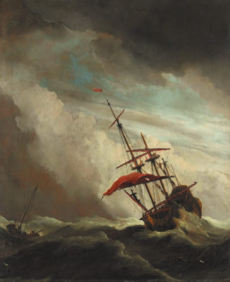
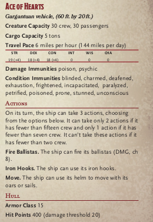

# The Ace of Harts

## Current Crew

* Captain: [Ector "Antlers" Caveer](../../people/Ector_Antlers.md)
  * elected by the crew based on overall respect for competence at seafaring and command, has total and final authority over all that happens on board
* First Mate: [Chadwick "Chad" Bronzecut](../../people/Chadwick.md)
  * advisor and right hand man to captain, in charge of recruiting (or press ganging), technically outranks quartermaster but has less actual authority
* Quartermaster: [Trammitch "Whiplash" Jones](../../people/Trammitch_Whiplash.md)
  * maintains order, resolves quarrels and settles disputes, distributes loot and pays wages, represents the interests of the crew; most authority on ship after captain
* Second Mate: [Harper ___](../../people/Harper.md)
  * petty officer and advisor to the captain, in charge of anything the first mate and quartermaster don't want to deal with (duties can be combined with first mate)
* Engineer: [Kirsta "Bavvy" Bavigard](../../people/Kirsta_Bavvy.md)
  * accountant, in charge of tracking ship funds, making necessary purchases for the upkeep of the ship, and outfitting the ship with supplies; reports directly to captain (duties can be combined with first mate)
* Navigator (Sailing Master): [Valierre "Val" Louis-Baptiste Jean-Alexandre Pontfotaine VIII](../../people/pcs/Valierre.md)
  * in charge of maps and navigation, has final say on where ship goes and which routes are taken; reports directly to captain
* Bosun (Boatswain): [Benðron "Ben" Vörðurhínn](../../people/Bendron.md)
  *  in charge of ship maintenance and inspection, ensures that vessel always remains seaworthy and in good condition, inspects vessel thoroughly every morning; reports to quartermaster
* Gunner: [Gideon ben Jacen](../../people/pcs/Gideon.md)
  * in charge of working and maintaining the ballistae, gives all order regarding ballistae during battle; reports to quartermaster
* Raster (Riggermaster): [Devan Caravast](../../people/Devan.md)
  * in charge of all deck activities such as weighing anchor and sail rigging, commands the crew with regard to deck duties; reports to quartermaster
* Lookout: [Stjern Kustos](../../people/pcs/Stjern.md)
  * typically two to four per ship who work in shifts, staying in the crow's nest with a spyglass and keeping watch; reports to quartermaster 
* Coxie (Coxswain): [Harper](../../people/Harper.md) and [Whiplash](../../people/Trammitch_Whiplash.md)
  * sits at either the stern or the bow (or stands next to whomever is manning the wheel) and calls orders (typically relaying the orders of the captain or quartermaster) to the rowers or riggers so that they move in unison and coordinate properly, typically has the loudest voice on the ship; reports to the quartermaster (duties can be combined with quartermaster)
* Medic: [Stjern Kustos](../../people/pcs/Stjern.md)
  * ship doctor, in charge of treating all injuries and illnesses; reports directly to captain
* Cook: [Galt Schmorgan](../../people/Galt.md)
  * prepares meals for crew and is in charge of food and water stores; reports to quartermaster

